# Copyright & Platform Enforcement Report

I am choosing Youtube as my platform. 

# Youtube's Copyright Policy: 

YouTube detects copyrighted material through a combination of automated and manual
systems. The main automated tool is Content ID, which scans newly uploaded videos
against reference audio/video files supplied by eligible rights holders and generates a
Content ID claim when it finds a match. YouTube also supports other detection pathways
like the Copyright Match Tool (which helps identify reuploads or near-duplicates) and
manual copyright removal requests submitted by rights holders through YouTube’s 
reporting process. 

When content is flagged, the outcome depends on the type of flag. A Content ID claim
usually does not remove the video automatically; instead, the rights holder’s preset
policy determines what happens—commonly blocking the video, monetizing it, or tracking
viewership, sometimes only in specific countries. A formal copyright removal request (a
DMCA-style takedown) can lead to the video being removed and the channel receiving a
copyright strike, which can restrict channel features and create risk of termination if
strikes accumulate. 

YouTube provides different appeal paths for claims versus takedowns. For Content ID
claims, uploaders can file a dispute, and if rejected, they may be able to appeal;
YouTube sets response windows for the claimant to review and decide whether to uphold
the claim. For a takedown/strike, the uploader can submit a counter notification if
they believe the removal was incorrect or they have the rights to use the material; if 
the counter notification is accepted and forwarded, the claimant generally must show
evidence of legal action within a set period or the content may be restored.

For monetization, YouTube often allows rights holders to control how matched content
earns money. Under Content ID, a rights holder may choose to run ads and monetize the
video, and in some cases revenue may be shared depending on the arrangement and policy.
If the uploader disputes a claim, YouTube may hold or redirect revenue while the
dispute is pending under YouTube’s monetization rules for disputed Content ID claims.
Separately, YouTube’s Terms also state that YouTube may monetize content on the
platform, and creators are only paid if they have an applicable monetization agreement 
such as the YouTube Partner Program). 

Finally, YouTube operates special rights-management and licensing programs designed to
enable authorized uses or large-scale enforcement. Content ID itself functions as a
licensing-and-policy system for eligible rights holders, and YouTube also offers
broader rights tools through its copyright management framework. In addition, programs
like Creator Music provide a structured way for creators to use certain music under
licensing terms or revenue-sharing models, reducing the need for takedowns while still 
compensating rights holders.

# Fair Use Experiments 

My first task was a raw copyrighted clip, where I clipped 15 seconds and 30 seconds of the tv show Fairly Odd Parents. The 15 second clip was detected for copyrighted content before the video was fully uploaded. Youtube has a check while you are submitting your content to them, so my video flagged this immediately. The 30 second video was also flagged right before uploading the video; it took a bit longer than the 15 second video.  

https://youtu.be/ik11r_Ky5Cs

https://youtu.be/liiUmz32gik

My second task was the same 30 second clip of Fairly Odd parents but I was giving my commentary over it. I was trying to be educational by giving my opinion and thoughts of the TV show. The video was not detected until the video had been fully uploaded. 

https://youtu.be/vLRoQ4b8fNg 

Ultimately all three of my videos received copyright flags and restricted visibility within 20 seconds of uploading the video.

# AI Content Investigation 

PLEASE LOOK AT THE TV SHOW FAIRLY ODD PARENTS AND RECREATE THE MAIN CHARACTERS FROM THE SHOW IN ONE IMAGE

https://youtu.be/IqUKsIGvcek 

PLEASE LOOK AT THE STYLE OF THE SHOW OF FAIRLY ODD PARENTS AND CREATE A SPIN OFF SHOW, I WANT AN IMAGE OF THESE CHARACTERS WITH A NAME FOR THIS SHOW IN ONE IMAGE

https://youtu.be/hw4yzjTMl-Q 

Neither of my AI generated content has been flagged. 

OpenAI’s Terms of Use say you can’t use the services in a way that infringes someone else’s rights (which includes copyright). They also say you’re responsible for what you submit and what you do with the output, and you represent that you have the rights needed to provide your Input. And they make clear OpenAI provides the service “as is” and disclaims warranties including non-infringement: so you can’t assume outputs are automatically “copyright-safe.”

You keep your rights in your Input and you “own the Output” (OpenAI assigns to you whatever rights it may have in the output), to the extent permitted by applicable law. OpenAI also notes outputs may not be unique and other users can receive similar outputs; your ownership doesn’t extend to other users’ outputs. OpenAI’s Help Center summarizes this plainly: OpenAI will not claim copyright over content generated (in that FAQ, for API outputs). Even if OpenAI assigns you its rights, copyright law may not grant copyright protection to “purely AI-generated” material without sufficient human authorship (U.S. Copyright Office guidance).

You own it under the contract (OpenAI’s terms), but whether it’s actually copyrightable depends on your jurisdiction and how much human creative control/authorship is present.

# Legal Analysis 

## 15 second copyright Video  
This use is minimally transformative because it presents the clip essentially “as-is,” likely for the same entertainment/informational purpose as the original. Even if your channel isn’t monetized, “noncommercial” helps only a little when the use is otherwise non-transformative. Courts weigh transformation heavily under Factor 1.

Most clips people upload (film/TV/music/sports highlights) are highly creative or performance-based, which generally weighs against fair use (creative works get stronger protection than factual/reference works)

15 seconds can still be substantial if it includes a memorable or “heart” moment. Factor 3 is not just duration; it’s also whether you took the most valuable portion.

A raw clip can act as a market substitute for official clips or licensed excerpts—especially if the original owner sells/monetizes short clips, highlight packages, or licensed social media snippets. Even if your clip is short, widespread unlicensed clips can undermine licensing markets.

## 30 second copyright Video  
The first two fair-use factors are the same as the 15 second clip 

30 seconds is a larger taking and increases the chance you captured multiple key beats (dialogue, chorus, punchline, signature play, etc.). That weighs more strongly against fair use. 

Longer excerpts are more likely to substitute for authorized clips and can have a greater negative effect on potential licensing/advertising markets

## Commentary Video

Adding your own commentary, opinions, and educational explanation pushes the use toward transformative purposes (criticism, commentary, teaching), which courts weigh heavily under Factor 1. It’s also relevant whether you were monetizing; noncommercial/educational intent helps, but the key is that you’re using the clip to say something new about it, not just to re-post it. (Fair use factor list: 17 U.S.C. § 107.)

This likely still weighs against fair use (or at best is neutral), because most video clips people comment on (TV/film/music/sports) are creative/expressive works, which get stronger protection than factual works.

If you used short excerpts, paused, cropped, or otherwise used only what was needed to make your educational points, Factor 3 looks better.
If you used long continuous segments (especially the “best moments” or the “heart” of the work), Factor 3 looks worse—even with commentary.

Commentary/education often helps here because your video is less likely to be a market substitute for the original (a viewer who wants the original experience still needs the original). But if your upload contains enough of the work that people could use it instead of official clips (or harms licensing markets for excerpts), then Factor 4 can still weigh against you.

# Case Law 

Google v. Oracle (2021: 

The Supreme Court’s fair-use holding emphasized transformative purpose and the functional, re-used-to-build-new-things context (reimplementing API declarations to enable programmers to create on a new platform).

My raw clip uploads are the opposite fact pattern: they reuse expressive audiovisual content without adding a new purpose (like commentary/education/parody) or enabling a new functional system. So Google v. Oracle is most useful as a contrast showing why transformation mattered there.

In my commentary video I am using the video for educational purposes; my use is new and transformative 

Sega v. Accolade (9th Cir. 1992):

Sega is famous for holding that intermediate copying for reverse engineering can be fair use when it’s the only way to access unprotected functional elements needed for interoperability/compatibility.
Like Google v. Oracle, Sega is about copying for a functional, transformative objective (learning system interfaces), not distributing expressive clips to an audience. It doesn’t support “raw excerpt posting,” but it could help me discuss how courts treat purpose differently depending on whether the copying is exploitative vs. enabling.

# Gap Analysis 

Legal theory (copyright law)
Fair use is a context-specific balancing test under the four statutory factors, not a simple “under X seconds is fine” rule.

YouTube says uploads are automatically scanned by Content ID, and if there’s a match you can receive a Content ID claim with outcomes like blocking/monetizing/tracking depending on the rightsholder’s settings. YouTube also describes a dispute process for Content ID claims where the claimant has 30 days to respond.

Both your 15s and 30s raw clips were detected almost immediately, which is consistent with automated fingerprinting and shows that detection speed is driven by platform systems and rightsholder reference files—not by a nuanced fair-use evaluation.

My commentary video:

My raw clips were detected during a pre-publish check phase.
My commentary clip was detected only after full upload/processing.

YouTube’s detection is primarily automated matching, and the system’s timing (pre-check vs post-processing) doesn’t reflect a nuanced fair-use judgment—just when the match gets computed and applied. The “fair use” question, if raised at all, typically comes later via disputes or legal processes.

## Screenshots

### Notices
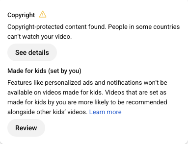
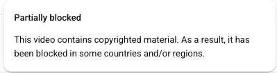

### AI images
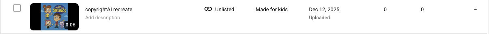
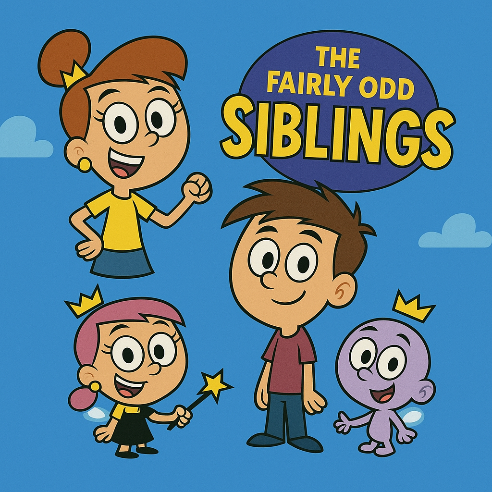
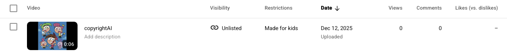
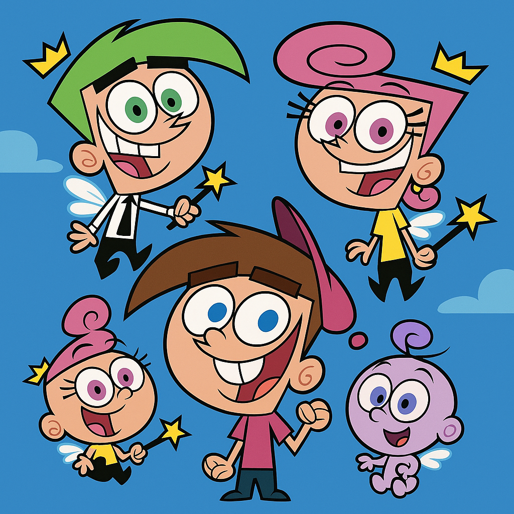

### Commentary tests
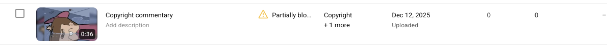
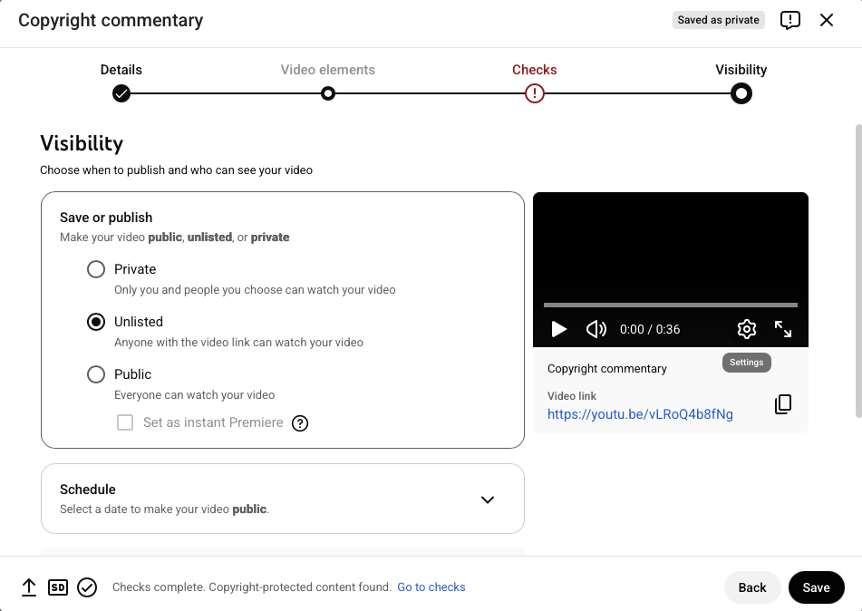
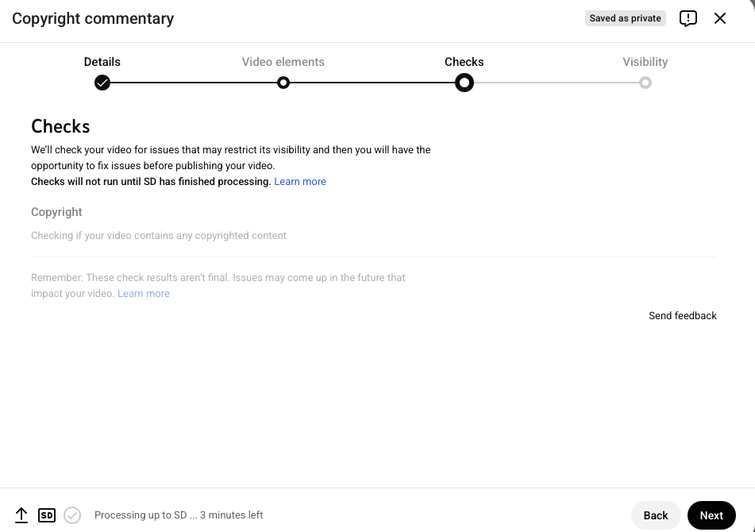

### Raw clip tests
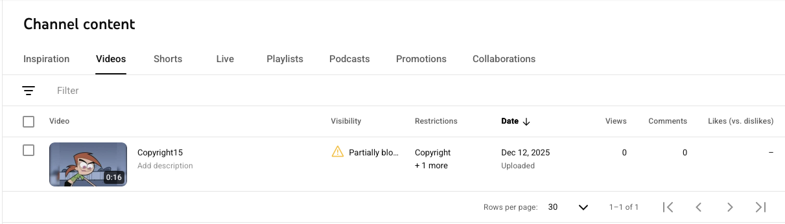
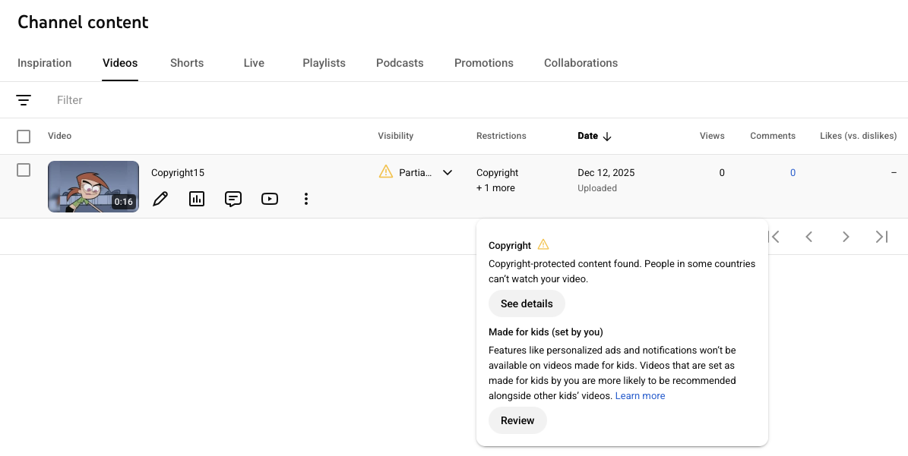
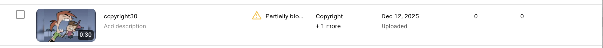

